# Group 3

---

```mermaid
flowchart TD
    A["Start Global Request for Information Tracker Requirements"]

    subgraph H1["Hour 1: Request Submission & Catalog"]
        H1A["Use artificial intelligence model to list request-for-information form fields"]
        H1B["Convert field list to spreadsheet (comma-separated values file)"]
        H1C["Commit form-fields spreadsheet to GitHub"]
        H1A --> H1B --> H1C
    end

    subgraph H2["Hour 2: Workflow & Routing"]
        H2A["Use artificial intelligence model to draft request-for-information approval steps"]
        H2B["Generate approval process diagram"]
        H2C["Publish process diagram to collaboration space"]
        H2A --> H2B --> H2C
    end

    subgraph H3["Hour 3: Notification & Collaboration"]
        H3A["Use artificial intelligence model to enumerate notification channels"]
        H3B["Generate messaging platform configuration"]
        H3C["Deploy and verify in development workspace"]
        H3A --> H3B --> H3C
    end

    subgraph H4["Hour 4: User & Access Management"]
        H4A["Use artificial intelligence model to produce role-based access control matrix"]
        H4B["Generate configuration file for authentication service (YAML format)"]
        H4C["Open pull request in GitHub interface"]
        H4A --> H4B --> H4C
    end

    subgraph H5["Hour 5: Analytics & Reporting"]
        H5A["Use artificial intelligence model to list key performance indicators and sample database queries"]
        H5B["Populate database query file via script"]
        H5C["Run queries in continuous integration system and export report (comma-separated values file)"]
        H5A --> H5B --> H5C
    end

    subgraph H6["Hour 6: Consolidation & Presentation Preparation"]
        H6A["Collect all requirement artifacts via script"]
        H6B["Build presentation deck using Python library"]
        H6C["Perform final review and tweaks"]
        H6A --> H6B --> H6C
    end

    Z["Global Request for Information Tracker Artifacts Ready"]

    A --> H1A
    H1C --> H2A
    H2C --> H3A
    H3C --> H4A
    H4C --> H5A
    H5C --> H6A
    H6C --> Z
```

| Hour | Artifact(s)                                  | Description                                                   |
|------|----------------------------------------------|---------------------------------------------------------------|
| 1    | `rfi_form_fields.csv` (Git commit link)   | A spreadsheet listing every form field, type and validation; auto-committed via your GitHub Action |
| 2    | `approval_flow.puml` (or `.svg`) (Confluence page link) | A PlantUML (or rendered SVG) diagram of your approval steps; published into your team’s Confluence space |
| 3    | `slack_integration.json` `teams_integration.json` (Dev workspace deployments) | Slack app manifest with triggers; Teams webhook configuration; deployed and verified in your dev Slack/Teams environments |
| 4    | `auth_rbac.yaml` (GitHub Pull Request)     | YAML file defining roles & permissions for your authentication service; PR opened against your auth-service repo |
| 5    | `kpis.sql` `kpi_report.csv`               | SQL script containing KPI queries; results of those queries exported for dashboard prototyping |
| 6    | `RFI_Requirements_Deck.pptx` `/artifacts` folder | Auto-generated slide deck (10 slides); all above files bundled for final review |

